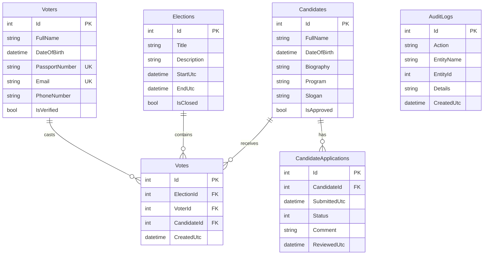

# ERD-диаграмма базы данных

Диаграмма показывает основные таблицы SQLite-базы и связи между ними.

## Ограничения данных

- `Voters.PassportNumber` должен быть уникальным.
- `Voters.Email` должен быть уникальным.
- Один избиратель может проголосовать только один раз в рамках одних выборов.
- Голос связан с выборами, избирателем и кандидатом.
- Заявка кандидата связана с кандидатом.
- Журнал аудита хранит действия системы и администратора.
