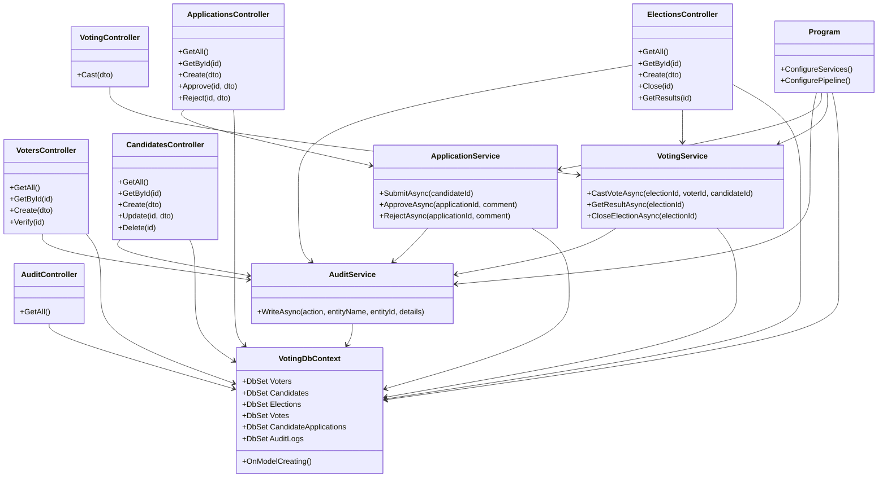
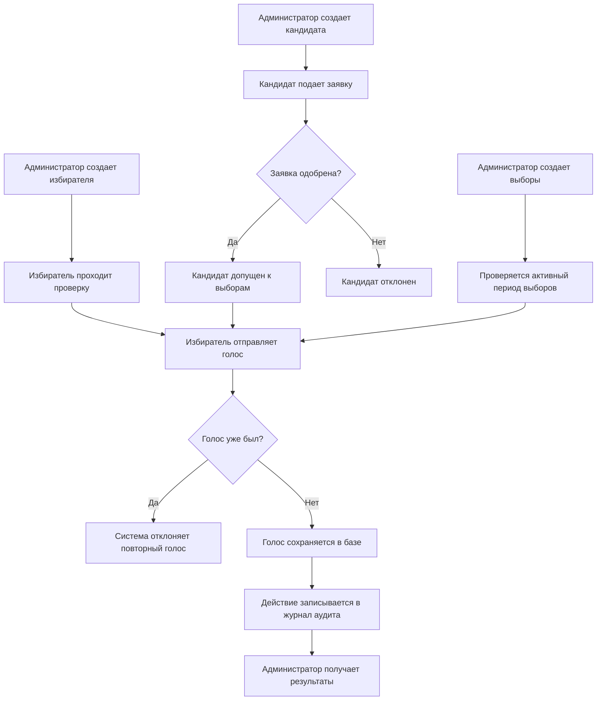

# UML-диаграмма модулей и бизнес-логики

Диаграмма отражает связь контроллеров, сервисов, контекста базы данных и сущностей проекта.

```mermaid
classDiagram
    class Program {
        +ConfigureServices()
        +ConfigurePipeline()
    }

    class VotingDbContext {
        +DbSet Voters
        +DbSet Candidates
        +DbSet Elections
        +DbSet Votes
        +DbSet CandidateApplications
        +DbSet AuditLogs
        +OnModelCreating()
    }

    class VotersController {
        +GetAll()
        +GetById(id)
        +Create(dto)
        +Verify(id)
    }

    class CandidatesController {
        +GetAll()
        +GetById(id)
        +Create(dto)
        +Update(id, dto)
        +Delete(id)
    }

    class ElectionsController {
        +GetAll()
        +GetById(id)
        +Create(dto)
        +Close(id)
        +GetResults(id)
    }

    class VotingController {
        +Cast(dto)
    }

    class ApplicationsController {
        +GetAll()
        +GetById(id)
        +Create(dto)
        +Approve(id, dto)
        +Reject(id, dto)
    }

    class AuditController {
        +GetAll()
    }

    class VotingService {
        +CastVoteAsync(electionId, voterId, candidateId)
        +GetResultAsync(electionId)
        +CloseElectionAsync(electionId)
    }

    class ApplicationService {
        +SubmitAsync(candidateId)
        +ApproveAsync(applicationId, comment)
        +RejectAsync(applicationId, comment)
    }

    class AuditService {
        +WriteAsync(action, entityName, entityId, details)
    }

    Program --> VotingDbContext
    Program --> VotingService
    Program --> ApplicationService
    Program --> AuditService

    VotersController --> VotingDbContext
    VotersController --> AuditService
    CandidatesController --> VotingDbContext
    CandidatesController --> AuditService
    ElectionsController --> VotingDbContext
    ElectionsController --> VotingService
    ElectionsController --> AuditService
    VotingController --> VotingService
    ApplicationsController --> VotingDbContext
    ApplicationsController --> ApplicationService
    AuditController --> VotingDbContext

    VotingService --> VotingDbContext
    VotingService --> AuditService
    ApplicationService --> VotingDbContext
    ApplicationService --> AuditService
    AuditService --> VotingDbContext
```

## Основная бизнес-логика

```mermaid
flowchart TD
    A[Администратор создает избирателя] --> B[Избиратель проходит проверку]
    C[Администратор создает кандидата] --> D[Кандидат подает заявку]
    D --> E{Заявка одобрена?}
    E -->|Да| F[Кандидат допущен к выборам]
    E -->|Нет| G[Кандидат отклонен]
    H[Администратор создает выборы] --> I[Проверяется активный период выборов]
    B --> J[Избиратель отправляет голос]
    F --> J
    I --> J
    J --> K{Голос уже был?}
    K -->|Да| L[Система отклоняет повторный голос]
    K -->|Нет| M[Голос сохраняется в базе]
    M --> N[Действие записывается в журнал аудита]
    N --> O[Администратор получает результаты]
```
